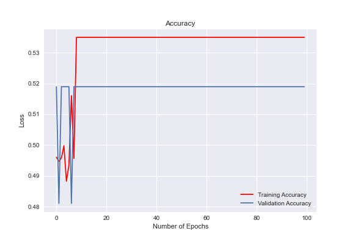
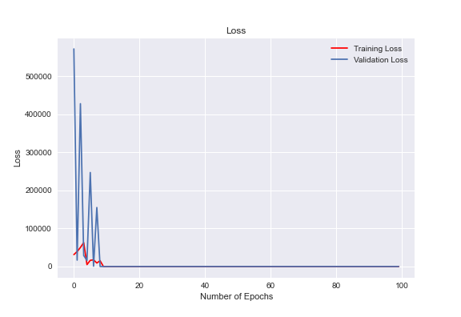

# Neural Network Charity Analysis

> Creating a binary classifier that is capable of predicting whether applicants will be successful if funded by Alphabet Soup.

## Overview of Project

Preprocessing the data for the neural network, Compile,train and evaluate the model & finally optimizing the model.

## Results

### Data Preprocessing

The categorical data we want to predict is whether the charity was met its goals, which is represented in the tabular data with the "IS_SUCCESSFUL" column. Therefore, we drop it. The "EIN" and "NAME" columns were removed as they don't offer any relevant data that could help the model perform better. The remaining columns became the features for the model.

### Compiling, Training, and Evaluating the Model
We have 5 layers with respectively [60,70,50,40,10] neurons respectively in their layers. All layers had relu activation functions and the output layer had a sigmoid activation function. I started with these parameters as relu does better with nonlinear data

## Summary

It's about 50% accurate which means the high amount of neurons had no impact on the success of the model, and it's not particularly effective to begin with. If I were to redo this, I would attempt a random forest classification model.

## Todo Checklist

A helpful checklist to gauge how your README is coming on what I would like to finish:

- [ ] Improve the Data Processing.
- [ ] Compare to Random Forest.
